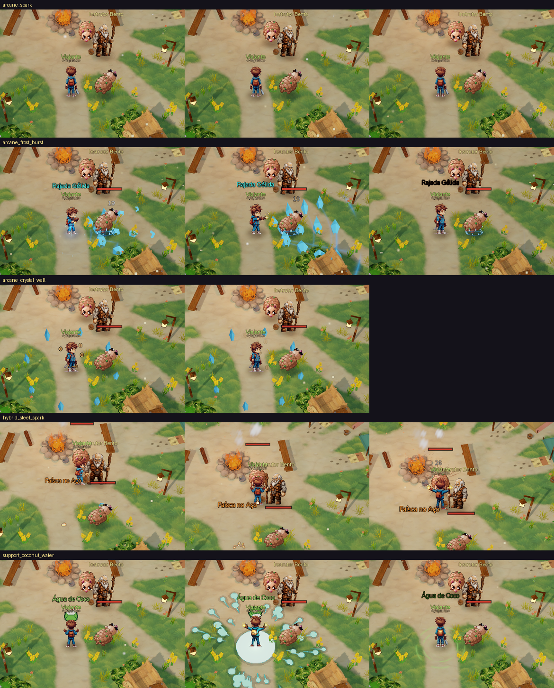
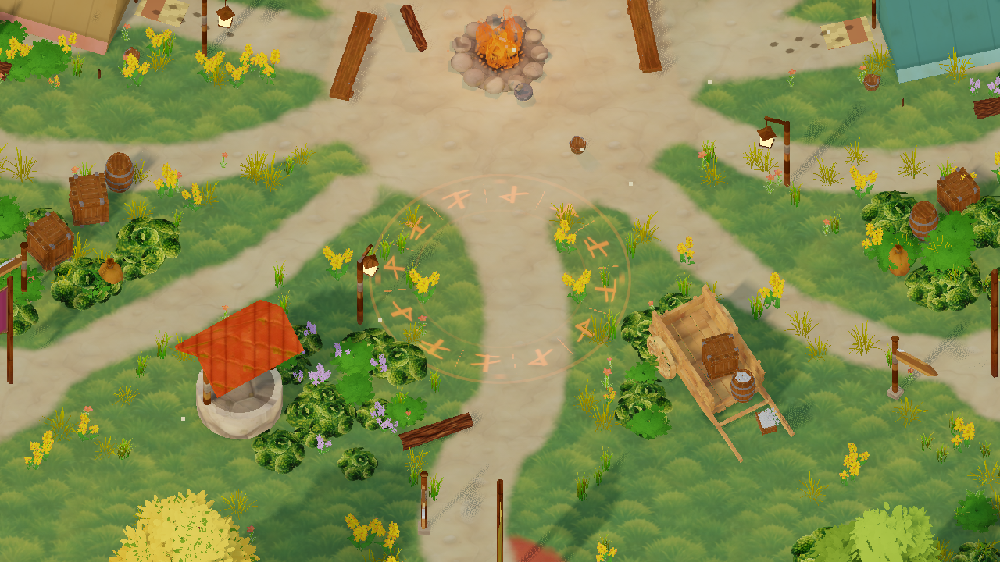
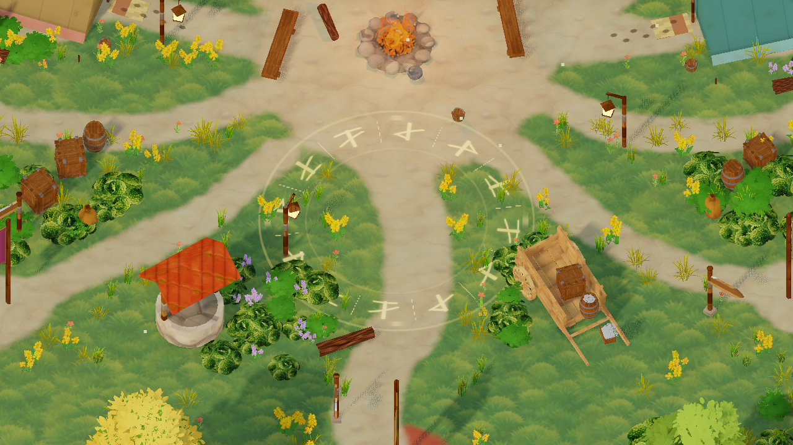
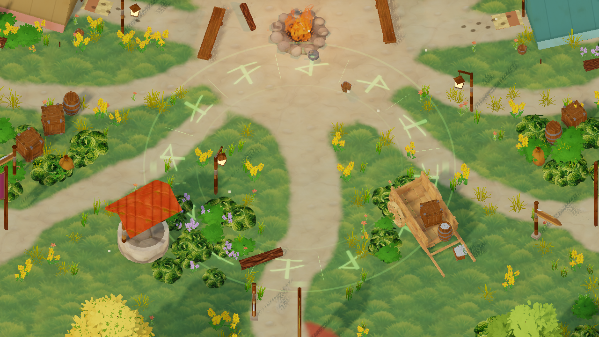

# Magias: contato, volume e mira rúnica

Capturas do cliente real em `magias-vivas-v2/`. A carga e a mira usam a cor da magia selecionada.

- Contato: clarão breve no alvo e no chão. Qualidade alta usa iluminação local sem sombras, com limite compartilhado de quatro luzes. Demais qualidades preservam o clarão por shader.
- Gelo: cristais facetados com profundidade emergem em sequência até a ponta do cone; removido o grande desenho plano. A parede também recebe contato luminoso.
- Ritmos: descarga abrupta, fogo volumétrico turbulento, gelo progressivo e cura suave.
- Mira: anel discreto, runas mais intensas e halo suave. Mantém alcance, confirmação, cancelamento e controles móveis existentes.

Validação: suíte de efeitos 634/634; camadas de magia 23/23; contato 11/11; áudio de carga 24/24; testes de carga e mira móvel aprovados. Capturas renderizadas em GPU sem erros de shader. Não foi medido FPS nesta validação.
