# Menus e caverna viva

A interface usa a linguagem do inventário: painéis escuros chanfrados, bronze discreto, ouro para seleção, fonte de leitura e texto claro. Aplicada a personagem, skills, atributos, missões, loja, troca, companheiros, altar, configurações, diálogos e menus de interação.

As configurações foram agrupadas em vídeo/interface, som e controle. A rolagem e a adaptação à área útil continuam disponíveis em telas menores. O altar aceita IDs simples de equipamento e dados ricos de encaixe, e mostra nomes, textos e superstição traduzidos.

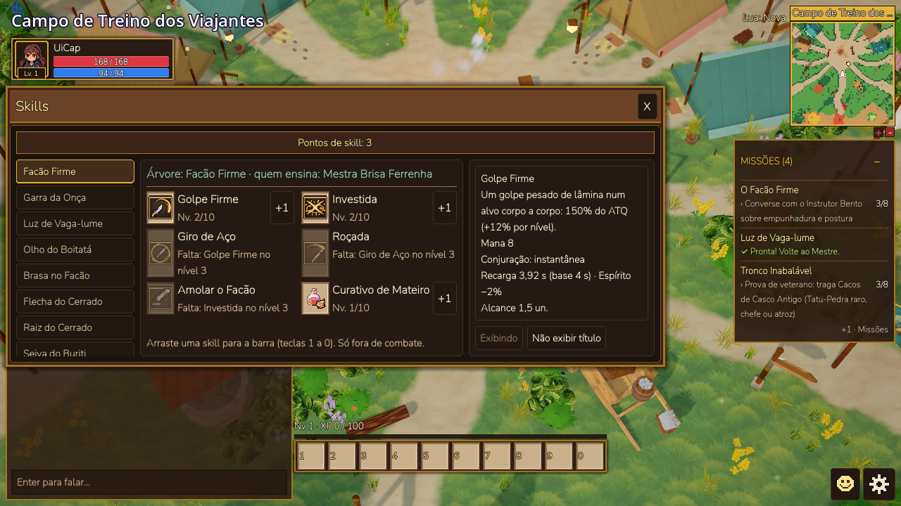
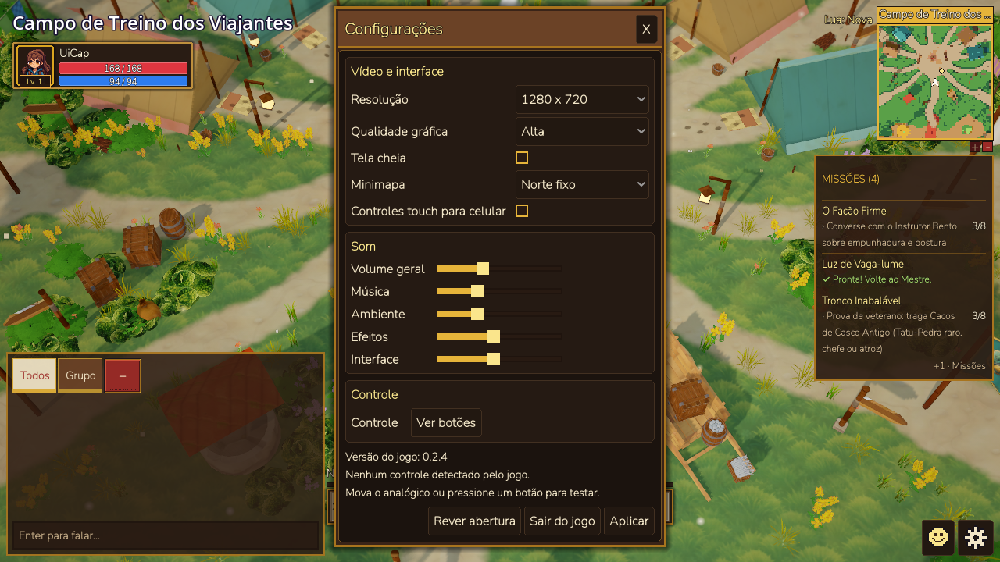
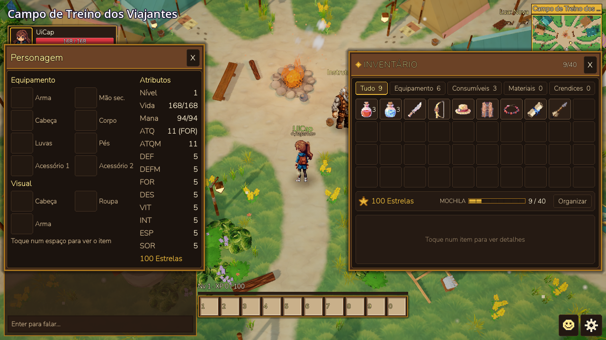
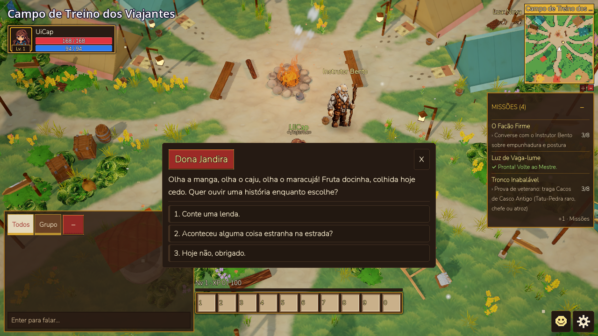
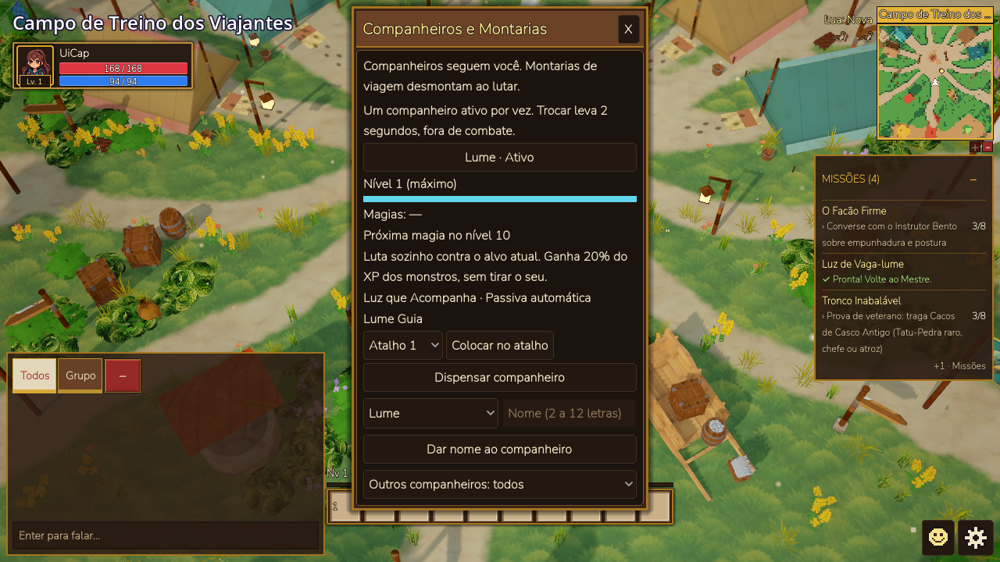
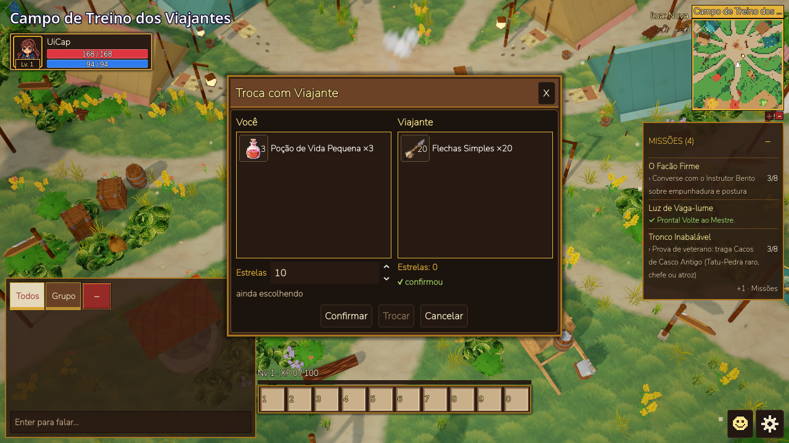
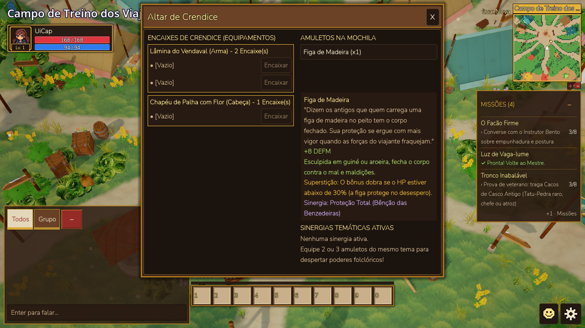

## Cachoeira e passagem escondida

No **quarto andar**, a cachoeira esconde a passagem existente para o **quinto andar**, onde está o Boitatá. São três cortinas curvas de água, com fluxo irregular, bacia com espuma e ondas, spray, névoa baixa, cornija e ombreiras de pedra com musgo. O som de água é original, sintetizado para o projeto, posicional e controlado pelo volume de Ambiente.

A passagem fica atrás da água, em `(0, 0, -30)`. Não tem placa flutuante, portal luminoso ou ícone revelando o segredo no minimapa. Mantém a exigência da missão final `arc1_final_boitata`; o retorno do quinto andar chega em frente à cachoeira. A água fica mais transparente perto do jogador para preservar a leitura da passagem.

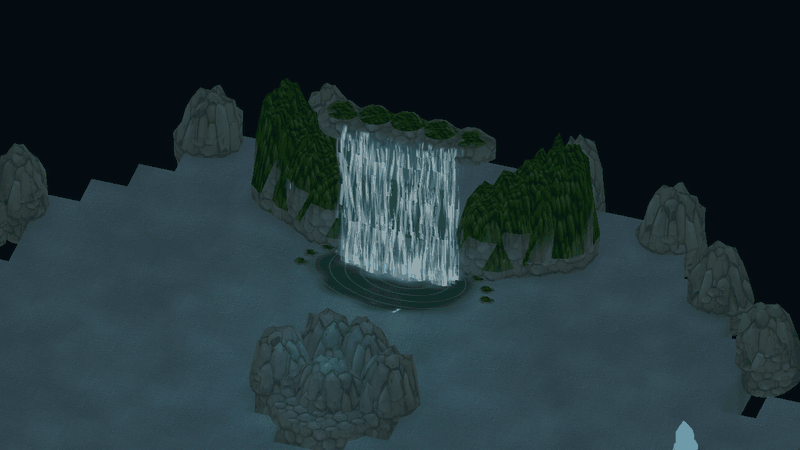
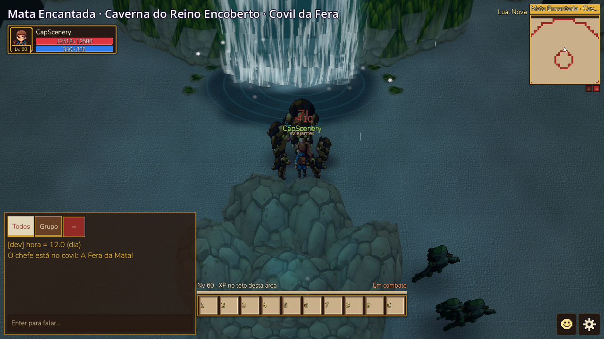

## Arena do chefe final

A câmara do quinto andar tem paredes monumentais e pilares de rocha, chão escuro com fissuras irregulares que respiram luz de brasa, cristais âmbar discretos, pontos quentes de luz e brasas ascendentes. O espaço central de combate e o covil original do Boitatá foram preservados.

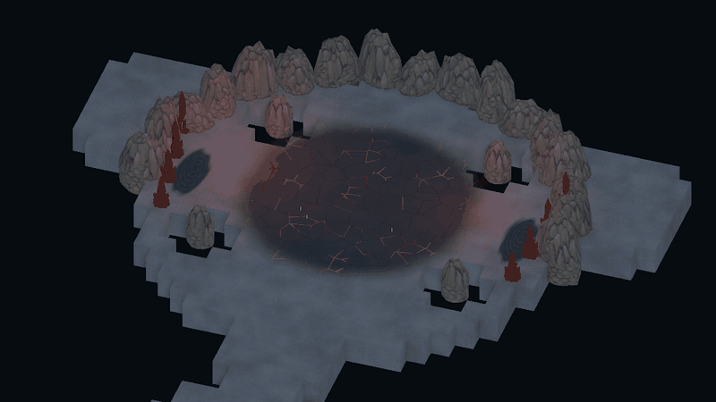
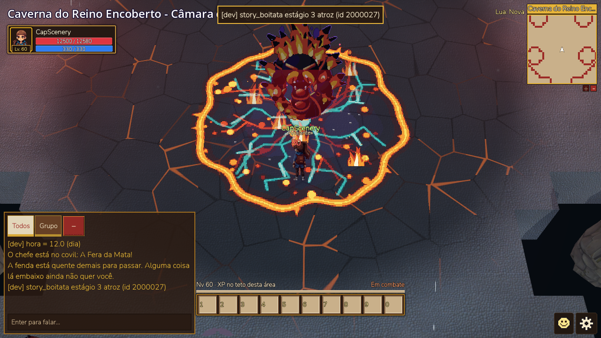

## Outros andares e qualidade

Os nichos de cristal receberam poças com ondas, umidade e névoa baixa; as paredes ganharam volume e o ambiente recebeu oclusão e brilho moderados. Complementa as gotas, poeira, morcegos e cristais pulsantes existentes.

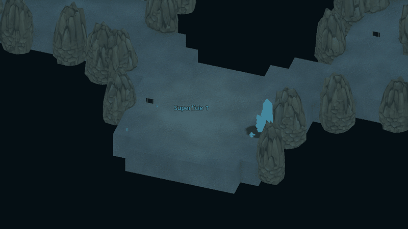

Os efeitos são exclusivos do cliente: não criam obstáculos ou alteram a navegação do servidor. Até duas luzes extras por mapa, sem sombras; qualidade baixa desliga essas luzes e a névoa extra e reduz partículas. A queda d’água principal permanece visível. Geometria extra tem distância de corte.

Validação: interface 114/114 e Skills aprovadas; capturas desktop 1280×720 e 960×540 e móvel 1600×720; navegação das cavernas 100/100; água/passagem/qualidade/limpeza 34/34; história e acesso ao final 368/368. Capturas da água e do chefe também no cliente conectado a um servidor isolado. Não houve medição de FPS.

A referência orientou movimento, umidade e contraste de luz; não foram usados assets do vídeo.
